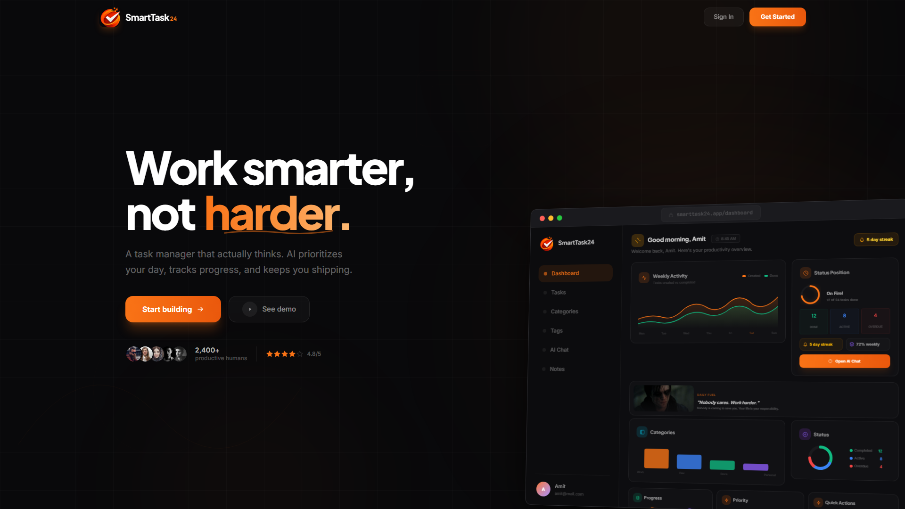

# SmartTask24

**Intelligent Task Management — powered by AI**

> **\"Work smarter, not harder.\"** SmartTask24 is a full-stack task management platform that uses artificial intelligence to prioritize your day, track your progress, and keep you shipping. Built with React, Spring Boot, and the Gemini API.

---

## Tech Stack

[](https://react.dev)
[](https://vitejs.dev)
[](https://tailwindcss.com)
[](https://recharts.org)
[](https://java.com)
[](https://spring.io)
[](https://mysql.com)
[](https://jwt.io)
[](https://deepmind.google/gemini)

---

## Screenshots

### Landing Page


---

## Features

### Task Management
Full CRUD with priority levels (Low / Medium / High / Urgent), status tracking (Pending / In Progress / Completed / Overdue / Archived), due dates, estimated time tracking, recurring tasks, subtasks, checklists, tags, categories, colors, and file attachments.

### Interactive Dashboard
Real-time analytics with rich SVG charts — weekly activity area charts, category breakdown bars, status distribution donuts, priority radial bars, and completion progress rings with smooth animations and gradients.

### AI Assistant
Natural language task management powered by the Gemini API. Create, update, delete, complete, list, and search tasks by simply describing what you want. Generate study schedules, analyze productivity, manage categories, and get personalized suggestions.

### Weather Integration
Real-time weather display with animated visual effects — sun, rain, snow, thunder, fog, and mist. The greeting adapts to time of day, and the interface responds to current weather conditions with dynamic colors and ambient effects.

### Smart Notifications
In-app notification system with scheduled morning reminders (6 AM), evening reviews (9 PM), and overdue task alerts. Real-time badge counts and read/unread tracking keep you informed without overwhelming you.

### Progress Tracking
Streak tracking with flame indicators, weekly and monthly completion rates, motivational quotes with dynamic GIFs, and visual progress rings that animate on load.

---

## Getting Started

### Prerequisites
- Node.js 18+
- Java 17+
- MySQL 8+

### Backend Setup

```bash
# Navigate to backend directory
cd backend

# Configure application.properties
# Edit: src/main/resources/application.properties
# Set your MySQL credentials and JWT secret

# Run the Spring Boot application
mvn spring-boot:run
```

The backend starts on `http://localhost:8080` with automatic database schema creation via JPA.

### Frontend Setup

```bash
# Navigate to frontend directory
cd frontend

# Install dependencies
npm install

# Configure environment variables
cp .env.example .env
# Edit .env and add your Google and GitHub OAuth client IDs

# Start development server
npm run dev
```

The frontend starts on `http://localhost:5173` and proxies API requests to the backend.

---

## API Overview

All endpoints are prefixed with `/api` and proxied from the Vite dev server to Spring Boot.

| Route | Description |
|---|---|
| `POST /api/auth/google` | Google OAuth login |
| `POST /api/auth/github` | GitHub OAuth login |
| `GET /api/dashboard` | Full dashboard analytics |
| `GET/POST /api/tasks` | List and create tasks |
| `PUT/DELETE /api/tasks/{id}` | Update and delete tasks |
| `PATCH /api/tasks/{id}/complete` | Mark task complete |
| `GET /api/tasks/search?q=` | Search tasks |
| `GET /api/tasks/calendar` | Calendar range query |
| `CRUD /api/categories` | Category management |
| `CRUD /api/tags` | Tag management |
| `CRUD /api/notes` | Note management (Markdown) |
| `POST /api/ai/chat` | AI chat with context |
| `GET /api/notifications` | Notification management |

---

## Authentication

SmartTask24 uses OAuth 2.0 with JWT tokens. Login is available via:
- **Google** — One-click sign-in with Google Identity Services
- **GitHub** — OAuth 2.0 authorization flow

Tokens are stored in localStorage and automatically attached to API requests via an Axios interceptor. Token expiration is 24 hours (30 days with "Remember Me").

---

## Architecture

```
frontend/            React + Vite SPA
  src/
    pages/           Route-level components
    components/      Reusable UI components
    api/             Axios API clients
    context/         React context providers
    utils/           Utility functions

backend/             Spring Boot REST API
  src/main/java/
    controller/      REST controllers
    service/         Business logic
    repository/      JPA data access
    entity/          Database models
    security/        JWT + OAuth config
    dto/             Request/response objects
```

---

## License

This project is built as a demonstration of full-stack development with AI integration.
